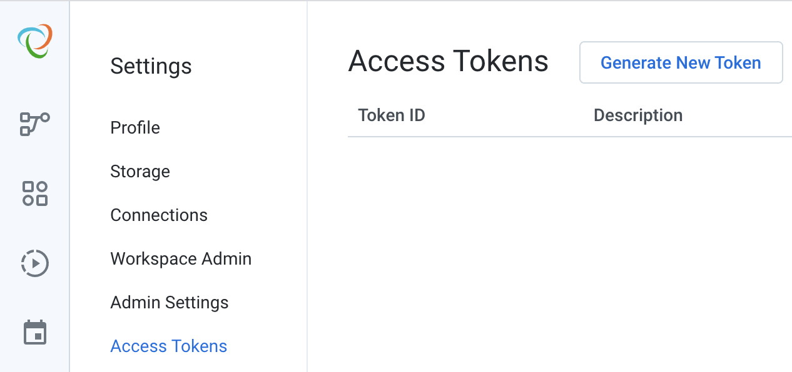
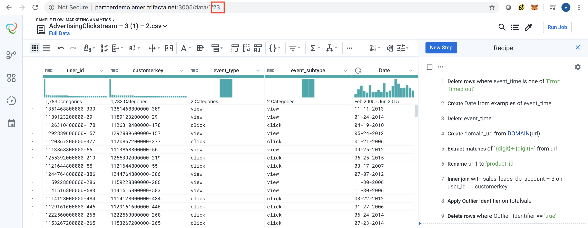
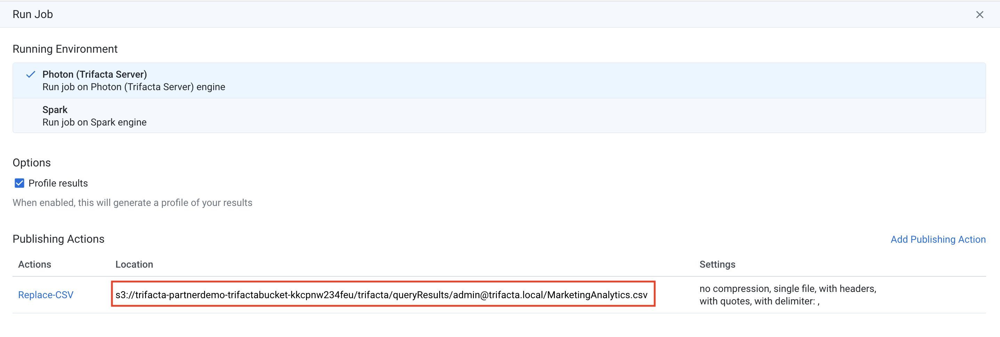

# trifacta

Trifacta client that makes it easy to integrate Trifacta into your production and data science workflows

### Usage Scenarios
- **Jupyter**: Invoke Trifacta jobs from a Jupyter notebook and pass data back and forth between Jupyter and Trifacta
- **Other Notebooks**: Integrate Trifacta with Azure Databricks, Zepellin or any other notebook-style interface that supports Python
- **Scripts**: Automate Trifacta jobs and input/output using python scripts that can be easily executed from the command line or called from an external scheduler

### Functionality
This library makes it simple to do the following:
1. Connect to a Trifacta instance
2. Run a job
3. Download results to a csv file and view in pandas dataframe

Note that file uploads and downloads are performed using Amazon S3, using the boto3 API


```python
#!pip install trifacta
import trifacta
```

If you need an access token, you can generate it as follows:




```python
#Step 1: Connect to Trifacta by providing the URL and API Access Token
t = trifacta.Client('http://partnerdemo.amer.trifacta.net:3005', 'YOUR_ACCESS_TOKEN')
```

#### Get the wrangled dataset id from the URL in the Trifacta UI
Make sure that you have run the job manually at least once


#### Note the output path (be sure to set it to "replace")



```python
#Step 2: Run the job
t.run_job(23)
```

    About to run job
    {'sessionId': '9d339e65-8898-4165-871b-b9db848dc099', 'reason': 'JobStarted', 'jobGraph': {'vertices': [76, 77], 'edges': [{'source': 76, 'target': 77}]}, 'id': 42, 'jobs': {'data': [{'id': 76}, {'id': 77}]}}
    2020-02-25 11:19:58.508231 InProgress
    2020-02-25 11:20:03.700189 InProgress
    2020-02-25 11:20:08.887794 Complete


    True


```python
%env AWS_PROFILE=trifacta_master_trial
```

    env: AWS_PROFILE=trifacta_master_trial


```python
#Step 3: Download results to a csv file and view in pandas dataframe
import boto3
s3 = boto3.client('s3', region_name='us-west-2')
```


```python
s3.download_file(Bucket='trifacta-partnerdemo-trifactabucket-kkcpnw234feu',
                Key='trifacta/queryResults/admin@trifacta.local/MarketingAnalytics.csv',
                Filename='MarketingAnalytics.csv')
```


```python
import pandas as pd
df = pd.read_csv('MarketingAnalytics.csv')
```


```python
df.head()
```


<div>
<style scoped>
    .dataframe tbody tr th:only-of-type {
        vertical-align: middle;
    }

    .dataframe tbody tr th {
        vertical-align: top;
    }

    .dataframe thead th {
        text-align: right;
    }
</style>
<table border="1" class="dataframe">
  <thead>
    <tr style="text-align: right;">
      <th></th>
      <th>user_id</th>
      <th>customerkey</th>
      <th>event_type</th>
      <th>event_subtype</th>
      <th>Date</th>
      <th>advertiser_id</th>
      <th>creative_id</th>
      <th>url</th>
      <th>product_id</th>
      <th>domain_url</th>
      <th>...</th>
      <th>customeraccount_number</th>
      <th>customerphone</th>
      <th>customeraddress</th>
      <th>cusotmerstate</th>
      <th>customerzipcode</th>
      <th>customercountry</th>
      <th>socialmedia</th>
      <th>totalsale</th>
      <th>Outlier_Identifier</th>
      <th>currencykey</th>
    </tr>
  </thead>
  <tbody>
    <tr>
      <th>0</th>
      <td>1126310400000-424</td>
      <td>1126310400000-424</td>
      <td>click</td>
      <td>click</td>
      <td>10-19-2005</td>
      <td>164332</td>
      <td>543027</td>
      <td>http://zdnet.com/praesent/lectus/vestibulum/qu...</td>
      <td>1124064000000-475</td>
      <td>zdnet</td>
      <td>...</td>
      <td>310170445527596</td>
      <td>(817)718-7309</td>
      <td>156 Cozy Berry Arc</td>
      <td>CA</td>
      <td>78710</td>
      <td>USA</td>
      <td>deneleaf</td>
      <td>7004.54</td>
      <td>False</td>
      <td>1</td>
    </tr>
    <tr>
      <th>1</th>
      <td>1229126400000-20</td>
      <td>1229126400000-20</td>
      <td>click</td>
      <td>click</td>
      <td>08-17-2009</td>
      <td>164332</td>
      <td>252030</td>
      <td>http://hostgator.com/a/feugiat.js?pid=12331008...</td>
      <td>1233100800000-528</td>
      <td>hostgator</td>
      <td>...</td>
      <td>310150240507900</td>
      <td>(469)201-1812</td>
      <td>3641 Euismod Avenue</td>
      <td>CA</td>
      <td>10769</td>
      <td>USA</td>
      <td>kinphanng</td>
      <td>4853.35</td>
      <td>False</td>
      <td>1</td>
    </tr>
    <tr>
      <th>2</th>
      <td>1126828800000-518</td>
      <td>1126828800000-518</td>
      <td>view</td>
      <td>view</td>
      <td>04-05-2006</td>
      <td>164332</td>
      <td>562765</td>
      <td>http://fc2.com/convallis/duis/consequat/dui/ne...</td>
      <td>1121904000000-509</td>
      <td>fc2</td>
      <td>...</td>
      <td>310170133079761</td>
      <td>(443)585-1769</td>
      <td>Ap #543-7410 Accumsan Rd.</td>
      <td>CA</td>
      <td>92845</td>
      <td>USA</td>
      <td>waldeelbailarin</td>
      <td>6885.15</td>
      <td>False</td>
      <td>1</td>
    </tr>
    <tr>
      <th>3</th>
      <td>1130112000000-336</td>
      <td>1130112000000-336</td>
      <td>click</td>
      <td>click</td>
      <td>04-05-2006</td>
      <td>164332</td>
      <td>466942</td>
      <td>http://biblegateway.com/est/phasellus/sit/amet...</td>
      <td>1130284800000-343</td>
      <td>biblegateway</td>
      <td>...</td>
      <td>310120073380564</td>
      <td>(215)669-3055</td>
      <td>900-8123 Aliquam Av.</td>
      <td>CA</td>
      <td>85517</td>
      <td>USA</td>
      <td>charlrey</td>
      <td>2593.31</td>
      <td>False</td>
      <td>1</td>
    </tr>
    <tr>
      <th>4</th>
      <td>1121990400000-216</td>
      <td>1121990400000-216</td>
      <td>view</td>
      <td>view</td>
      <td>09-27-2005</td>
      <td>164332</td>
      <td>400316</td>
      <td>https://zdnet.com/elementum/nullam/varius/null...</td>
      <td>1108339200000-416</td>
      <td>zdnet</td>
      <td>...</td>
      <td>310160496868669</td>
      <td>301 742 1112</td>
      <td>164 Cozy Anchor Rd</td>
      <td>CA</td>
      <td>60101</td>
      <td>USA</td>
      <td>scottylago</td>
      <td>3958.25</td>
      <td>False</td>
      <td>1</td>
    </tr>
  </tbody>
</table>
<p>5 rows × 31 columns</p>
</div>


